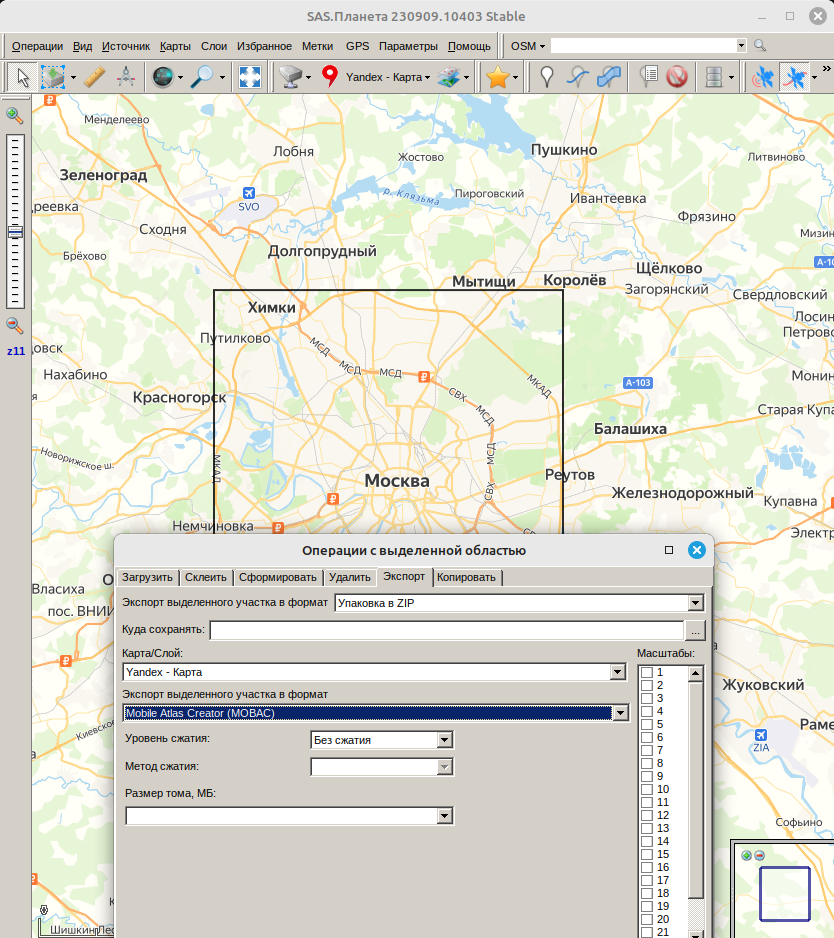

# Простенький тайловый сервер для карт

данные тайлов берутся на сервере из папки maps

для из получения используется http get запрос типа:

http://localhost:8080/?schema=osm&z=10&x=618&y=321&extension=png

## Тайлы

Тайлы скачивают с помощью программы SasPlanet в формате MOBAC

